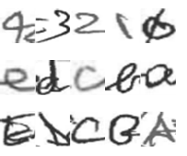
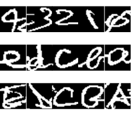
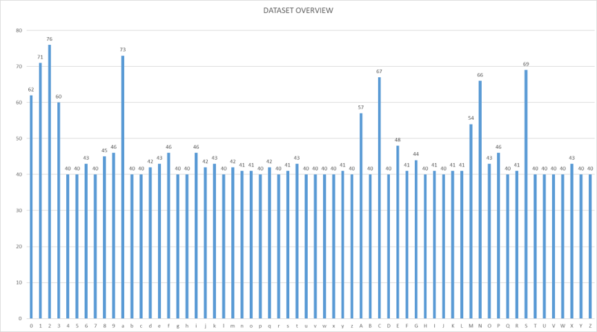

# Cursive-Handwriting-Dataset
The data of the dataset is collected from Professor Tom Gedeon and the complete handwriting paper of the CEDAR handwriting dataset.
A Cursive Handwriting Dataset with 62 classes cursive handwriting letters, "0-9, a-z, A-Z",\
each class at least have 40 pictures,the data is still updating

Here are Original data examples     and           Binary data examples:\
                            

Data mostly comes form Professor Tom's own handwritting and partly from CEDAR free handwriting pages.

Dataset Builder:
Hongming Zhang: Hongming-Zhang@outlook.com

Thanks to:
* Prof. Tom Gedeon:  tom@cs.anu.edu.au
* CEDAR dataset: https://cedar.buffalo.edu/handwriting/HRdatabase.html 

#### Data statistics


 

The number of data in each category in the dataset is counted, and the number of "raw data" and "binarized data" are the same. The number of data in each category will not be less than 40.

#### Dataset Sturcture

*<u>"The data format is a 28x28 ".png" format picture. The data set has a total of 62 categories of 0-9, a-z and A-Z, corresponding to the files "0" to "61" in the order of "label.txt". The data set is divided into two parts, the unprocessed original data image is stored in the "0" to "61" in the "V0.3/data" folder, and the binarized data image Stored in "0" to "61" in the "V0.3/data-bin" folder."</u>*


## in V0.3/dada is the 28 x 28 original handwriting letters\
## in V0.3/data-bin is the 28 x 28 binary handwriting letters


*<u>"The file structure is looking as follows. Feel free to find what you want in the data set."</u>*

```reStructuredText
the project
 |
 +--+V0.3                    #include all data in the dataset, youcan see each .png data on the page
 |  |
 |  +---data                 #include all general rgb data
 |  |  |
 |  |  |
 |  |  +---0                 # class "0"
 |  |  |
 |  |  …                     # the whole 62 classes of the data set, 0-9, a-z,A-Z
 |  |  |
 |  |  +---61                # class "Z"
 |  +---data-bin             # include all binary data of their rgb origin
 |  |  |
 |  |  |
 |  |  +---0
 |  |  |
 |  |  …
 |  |  |
 |  |  +---61
 |  +---label.txt            # labels from "0/" to "61/"
 +--V0.3.zip                 # the .zip file for the whole dataset
```


------

### Cite this Dataset

Use the following bibtex for citing the dataset: 

```reStructuredText
@...

```
